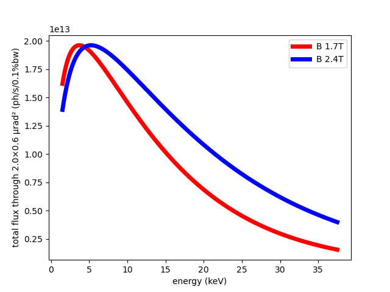
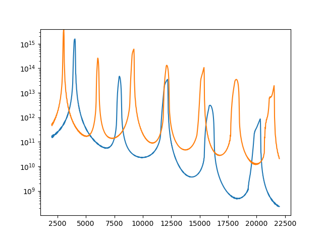
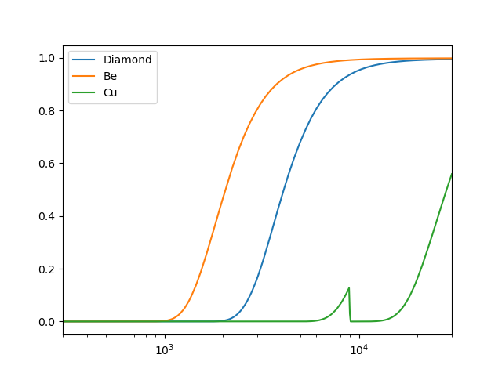
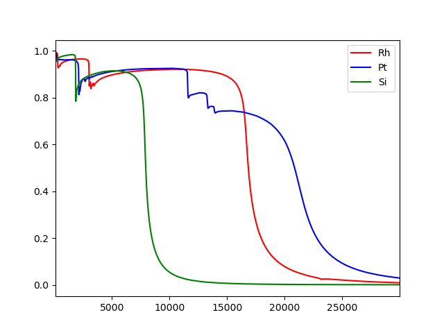
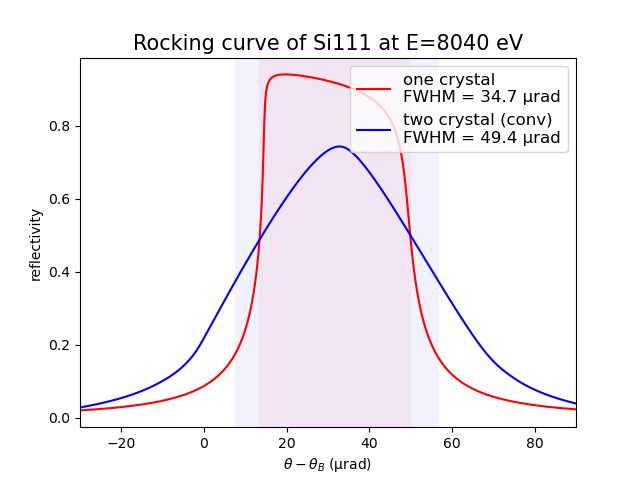
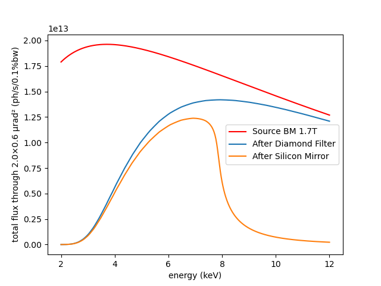

# xrt Training Environment

This repository provides a reproducible Python environment for running **xrt** examples using the **Pixi** package manager.

Pixi ensures installation of the same versions of Python and dependencies on **Linux**, **macOS**, and **Windows**.

## Disclaimer

This titorial uses **development versions** of **xrt**. While we do our best to ensure that everything works reliably during the training, absolute stability cannot be guaranteed.

The environment has been prepared to provide a consistent setup across different operating systems, but occasional issues may still occur due to platform differences or ongoing development.

---

# 1. Download and unpack **xrt**

Download the archive with the source code from:

https://github.com/kklmn/xrt/archive/refs/heads/new_glow.zip

Unpack the archive into a location of your choice.

---

# 2. Set up the environment

The project requires Python and several scientific libraries.  
Two installation options are provided:

- **Pixi (recommended)** – reproducible environment
- **Conda (alternative)** – manual environment setup

---

## 2.1 Pixi (recommended)

Pixi provides a reproducible environment across Linux, macOS, and Windows.

### Install Pixi

Official installation instructions:

https://pixi.sh/latest/

### Linux / macOS

```bash
curl -fsSL https://pixi.sh/install.sh | bash
```

Restart the terminal afterwards.

### Windows (PowerShell)

```powershell
powershell -ExecutionPolicy ByPass -c "irm https://pixi.sh/install.ps1 | iex"
```

Restart the terminal or VS Code afterwards.

### Verify installation

```bash
pixi --version
```

### Install the environment

Open a terminal in the **xrt** folder and run:

```bash
pixi install -e gui
```

This installs all required dependencies and prepares the environment.

---

## 2.2 Conda (alternative)

If Pixi is not available, the environment can be created manually using Conda.

Create a new environment:

```bash
conda create -n xrt311 python=3.11
```

Activate the environment:

```bash
conda activate xrt311
```

Install required packages:

```bash
conda install numpy scipy matplotlib pyopencl pyopengl freetype-py qtpy pyqt pyqtwebengine
```

---

# 3. Install **xrt** in your IDE

## VS Code

1. Open **VS Code**.
2. Select **File → Open Folder**.
3. Open the folder where you unpacked **xrt** in the previous step.

Open a terminal inside VS Code:

```
Terminal → New Terminal
```

Install the environment:

```bash
pixi install -e gui
```

This will install all required dependencies and create the Pixi environment used by the project.

The installation may take a few minutes the first time.

To allow executing pixi scripts in vscode on Windows add an policy exception

```powershell
Set-ExecutionPolicy RemoteSigned -Scope CurrentUser
```

---

## Spyder (WinPython)

If you are using **Spyder from WinPython**, you can run examples as is without installation.

---

The environment is now ready.

# 4. Calculating synchrotron sources

Navigate to the example folder:

```
xrt/examples/withRaycing/00_xRayCalculator
```

---

## Bending magnet example

Open the script:

```
calc_bm.py
```

Find the line:

```python
compareWithLegacyCode = True
```

Change it to:

```python
compareWithLegacyCode = False
```

(This avoids running the legacy implementation and speeds up the example.)

---

## Run the script

Run the script from your IDE or from the terminal.

Example using Pixi:

```bash
pixi run python calc_bm.py
```

After running the script, a plot window should appear showing the **bending magnet spectrum**.

## Modifying the source parameters

Next we will change the magnetic field of the bending magnet and compare the resulting spectrum with the original one.

Clone the following block of code in the script:

```python
source = rs.BendingMagnet(**kwargs)
I0xrt = source.intensities_on_mesh(energy, theta, psi)[0]
print(I0xrt.shape, I0xrt.max())
flux_xrt = I0xrt.sum(axis=(1, 2)) * dtheta * dpsi
plt.plot(energy/1e3, flux_xrt, 'r', label='xrt', lw=5)
```

Paste the copied block below the original one.

---

### Modify the magnetic field

Before the **cloned** block, add the following line:

```python
kwargs['B0'] = 2.4
```

Then modify the plotting line in the cloned block:

```python
plt.plot(energy/1e3, flux_xrt, 'b', label='B=2.4T', lw=5)
```

---

### Run the script again

Run the script once more:

```bash
pixi run python calc_bm.py
```

You should now see **two curves** on the plot:

- **red** – original bending magnet spectrum  
- **blue** – spectrum with magnetic field **B = 2.4 T**

The stronger magnetic field shifts the spectrum toward higher photon energies.




## Undulator spectrum

Now let us try a more challenging source and calculate the spectrum of an undulator.

Open the script:

```
calc_undulator.py
```

Run it once to see the default result.

Example using Pixi:

```bash
pixi run python calc_undulator.py
```

---

### Extend the energy range

To see more harmonics, extend the energy range.

Find line 74 and change it to:

```python
energy = np.linspace(2000, 22000, 1001)
```

Run the script again.

You should now see a wider spectrum containing more harmonic peaks.

---

### Use logarithmic scale on the y axis

The first harmonic is much stronger than the others and dominates the plot.  
To reveal the weaker higher harmonics, change the y axis to logarithmic scale.

Add the following line before showing the plot:

```python
plt.yscale('log')
```

Run the script again.

Now the low-intensity harmonics become visible instead of appearing absent on a linear scale.

---

### Expected result

With the extended energy range and logarithmic y axis, the plot should show:

- a very strong first harmonic
- several weaker higher harmonics at higher photon energies

This is a typical undulator spectrum structure.

### Modify the undulator parameters

Now let us see how the spectrum changes when we modify the deflection parameter `K` of our undulator.

Clone the following block of code:

```python
source = rs.Undulator(**kwargs)
I0, l1, l2, l3 = source.intensities_on_mesh(energy, theta, psi)

flux_through_aperture(energy, theta, psi, I0)
```

Paste the copied block below the original one.

Before the **second** line

```python
source = rs.Undulator(**kwargs)
```

add:

```python
kwargs['K'] = 1
```

Run the script again.

The modified undulator parameter changes the spectrum. Increasing the magnetic field strength shifts the harmonic structure toward **lower photon energies**.



---

### Explore further

Now try changing other source parameters and observe how the spectrum responds.

Examples:

- change the undulator `period`
- change the electron beam energy `eE`

After each change, run the script again and compare the positions and relative strengths of the harmonics.

These parameters strongly affect the photon energy of the emitted radiation.

## Comparing different materials

Now let us compare the transmission of different filter materials.

First import a pre-defined elemental material.  
Add the following import near the top of the script:

```python
import xrt.backends.raycing.materials.elemental as rme
```

---

### Add a Beryllium filter

Find the line that plots the diamond transmission:

```python
plt.semilogx(E, transm, label='Diamond')
```

Right after it, add the following lines:

```python
matBe = rme.Be()
muBe = matBe.get_absorption_coefficient(E)
transmBe = np.exp(-muBe * thickness * 0.1)
plt.semilogx(E, transmBe, label='Be')
plt.legend()
```

Run the script again.

You should now see transmission curves for **diamond** and **beryllium** on the same plot.

In general, **heavier materials absorb more strongly**, so their transmission decreases faster with energy.

---

### Try another material: Copper

Using the same approach, try adding a **copper filter**.

Hint:

```python
matCu = rme.Cu()
```

Compute the absorption coefficient, calculate the transmission, and plot it on the same graph.

After running the script, compare how the transmission of **diamond**, **beryllium**, and **copper** differs across the energy range.



## Compound materials

So far we have compared **elemental materials**.  
xrt can also work with **compound materials**.

Add the following import near the top of the script:

```python
import xrt.backends.raycing.materials.compounds as rmcp
```

---

### Add Boron Nitride

Create a compound material:

```python
material = rmcp.BoronNitride()
```

Calculate its absorption coefficient and transmission in the same way as for the elemental materials:
Run the script again.

Compound materials often show absorption behavior that differs from pure elements because their effective attenuation depends on the combination of constituent atoms.

# 6. Mirrors

Calculating mirror reflectivity requires an additional important parameter — the **incidence angle**.

Open the script:

```
calc_mirrors.py
```

Run the script to plot the reflectivity curve.

Example using Pixi:

```bash
pixi run python calc_mirrors.py
```

---

## Incidence angle

Notice how the **grazing incidence angle** `theta` is defined in the script.

The reflectivity of X-ray mirrors strongly depends on this angle.  
Try changing the value of `theta` and run the script again.

Observe how the reflectivity curve changes with the angle.

---

## Comparing mirror materials

Now let us compare reflectivity for different mirror materials.

Using the same approach as we did for filters, create two additional materials:

- **Platinum**
- **Silicon**

Example:

```python
matPt = rme.Pt()
matSi = rme.Si()
```

Compute the reflectivity curves for these materials and plot them together with the original one.

Run the script again and compare the results.

---

## What to observe

When comparing the materials, notice:

- the **critical energy** where reflectivity drops rapidly
- the presence of **absorption edges**

Heavier elements (such as platinum) generally provide higher reflectivity at higher photon energies, while lighter materials have lower critical energies.



# 7. Monochromatization

To monochromatize hard X-rays we use **crystalline materials**, which exhibit sharp resonance peaks in their reflectivity spectrum.

Open the script:

```
calc_crystal_rocking_curve.py
```

Run it.

Example using Pixi:

```bash
pixi run python calc_crystal_rocking_curve.py
```

This script calculates the reflectivity curve of a **silicon crystal** and also the **rocking curve** (angular detuning curve) for a double-crystal system.

---

## What to notice in the script

There are two important steps here.

### Bragg angle

The Bragg angle is identified with:

```python
crystal.get_Bragg_angle(E)
```

This gives the angle at which the crystal reflects X-rays of energy `E`.

### Reflectivity amplitude

The complex reflectivity amplitude is calculated with:

```python
crystal.get_amplitude()
```

This is the key quantity used to obtain crystal reflectivity.

---

## Angular range

Also notice the factor multiplying `dtheta` on line 14.

Although the plotted variable may look like a small angle range in radians, the actual range here is in **microradians**.

This is typical for crystal optics: the angular acceptance is extremely narrow.

---

## What this script calculates

In the current form, the script calculates the reflectivity curve at:

- a **fixed photon energy**
- a **limited angular range** around the Bragg angle

This is exactly what is needed for a **rocking curve**.

---

## A natural next question

Very often we want the opposite representation:

- **fixed angle**
- **varying photon energy**

In other words, instead of scanning angle around the Bragg condition for one energy, we want to scan energy at a chosen angle and calculate the reflectivity spectrum.

Conceptually, this is done by:

1. defining an energy array
2. choosing a fixed incidence angle
3. for each energy, calculating the reflectivity amplitude at that angle
4. plotting reflectivity versus energy

This gives the **energy acceptance curve** of the crystal at the chosen angle.

Such a spectrum is often more intuitive when thinking about monochromatization, because it directly shows which photon energies are reflected by the crystal.

---

## Suggested exercise

Try modifying the script so that:

- `theta` is kept fixed
- `E` becomes an array
- the reflectivity is calculated for each energy point

Then plot reflectivity as a function of energy.

This will show the spectral selectivity of the silicon crystal at a fixed angle.



# 8. Putting it all together: spectrum at the sample

Now let us combine several building blocks into one script and calculate a spectrum at the sample position.

We will:

- generate radiation from a **bending magnet source**
- propagate it through a **diamond filter**
- reflect it from a **silicon mirror**
- calculate the flux in **0.1% bandwidth**

We will use a broad source energy range from **2 to 12 keV**.

Create a new Python file and paste the following code into it:

```python
import numpy as np
import matplotlib.pyplot as plt
# path to xrt:
import os, sys; sys.path.append(os.path.join('..', '..', '..'))  # analysis:ignore
import xrt.backends.raycing.sources as rs

import xrt.backends.raycing.materials as rm
import xrt.backends.raycing.materials.elemental as rme


xPrimeMax, zPrimeMax = 1., 0.3  # mrad
energy = np.linspace(2000, 12000, 601)
theta = np.linspace(-1., 1., 3) * xPrimeMax * 1e-3
psi = np.linspace(-1., 1., 51) * zPrimeMax * 1e-3
kwargs = dict(eE=3, eI=0.1, B0=1.7, distE='BW',
              xPrimeMax=xPrimeMax, zPrimeMax=zPrimeMax)

source = rs.BendingMagnet(**kwargs)

matDiamond = rm.Material('C', rho=3.52)
thickness = 0.1  # mm

stripe3 = rme.Si()
thetaM = 4e-3

def main():

    dtheta, dpsi = theta[1] - theta[0], psi[1] - psi[0]
    I0xrt = source.intensities_on_mesh(energy, theta, psi)[0]
    flux_xrt = I0xrt.sum(axis=(1, 2)) * dtheta * dpsi
    plt.plot(energy/1e3, flux_xrt, 'r', label='Source BM 1.7T')

    mu = matDiamond.get_absorption_coefficient(energy)  # in cm^-1
    transm = np.exp(-mu * thickness * 0.1)
    plt.plot(energy/1e3, flux_xrt*transm, label='After Diamond Filter')

    rs3, rp3 = stripe3.get_amplitude(energy, np.sin(thetaM))[0:2]
    refl = abs(rs3)**2

    plt.plot(energy/1e3, flux_xrt*transm*refl, label='After Silicon Mirror')
    ax = plt.gca()
    ax.set_xlabel(u'energy (keV)')
    ax.set_ylabel(u'total flux through {0}×{1} µrad² (ph/s/0.1%bw)'.format(
        2*xPrimeMax, 2*zPrimeMax))
    plt.legend()
    plt.show()

if __name__ == '__main__':
    main()
```

Run the script.

Example using Pixi:

```bash
pixi run python your_script_name.py
```

---

## What this script does

This example combines three effects:

### 1. Source spectrum

The bending magnet source produces the initial spectrum over the full energy range.

### 2. Filter absorption

The diamond filter reduces the flux depending on photon energy.

### 3. Mirror reflectivity

The silicon mirror further modifies the spectrum through energy-dependent reflectivity at the chosen grazing angle.

---

## What to observe

The plot should show three curves:

- **Source BM 1.7T** — the original bending magnet spectrum
- **After Diamond Filter** — the spectrum after transmission through the filter
- **After Silicon Mirror** — the spectrum after both the filter and the mirror

This is already a simple beamline model: source → filter → mirror → sample.

---

## Suggested exercises

Try modifying the script and observe how the final spectrum changes.

Examples:

- change the bending magnet field `B0`
- change the filter thickness
- replace the silicon mirror with platinum
- change the mirror grazing angle `thetaM`

Each of these parameters changes the spectrum delivered to the sample.


